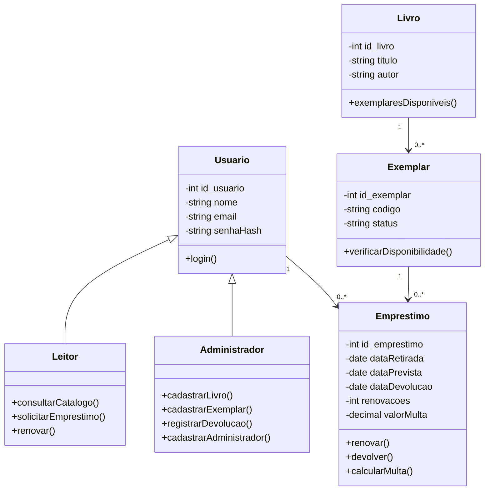

# Sistema de Biblioteca-back

Escolhi fazer um sistema de biblioteca porque é um tema que me chama atenção e que eu ja queria ter feito antes em C++. Me inspirei no sistema que biblioteca que a UFLA utiliza, e minha ideia é construir uma versão simplificada das funções principais que um sistema desse tipo tem, pensada para a biblioteca de uma universidade.

O sistema tem dois tipos de usuario. O leitor (aluno) consulta o catálogo, ve se o livro esta disponível, pega livros emprestados renova e acompanha seus prazos. O administrador (bibliotecario) cadastra os livros, controla o estoque e registra as retiradas e devoluções. Se um livro é devolvido depois do prazo, o sistema calcula uma multa pelos dias de atraso. 

## Modelagem inicial 
